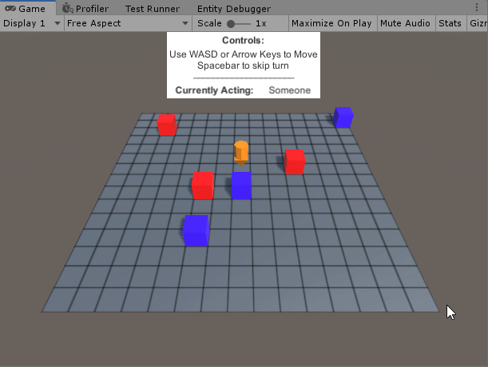

# Unity ECS Turn Based Prototype

This is a simple example of a turn based game using Unity's ECS. This was developed in Unity 2019.3.06f using Entities v 0.5.1.

This example is based off an [excellent session from Unite Copenhagen 2019](https://www.youtube.com/watch?v=mL4qrt-15TE). While it's a fantastic demo it seemed like the speaker did not yet have a firm grasp on the Unity's ECS API (which is extremely fair, it's very new and changing all the time), so I figured I would try to create a more up-to-date (and in my opinion a bit simpler) example.

 
*Players move, then entities move*

In every aspect of this prototype I tried to follow the "expected" workflow when working with Unity's ECS system (as of this writing and as far as I understand it).

All work takes place in jobs. It uses the conversion system to allow you to modify entity properties and converts them to "pure" entities. There are no gameobjects at runtime (aside from the UI - as of this writing there is no built-in UI for ECS).

[In progress]